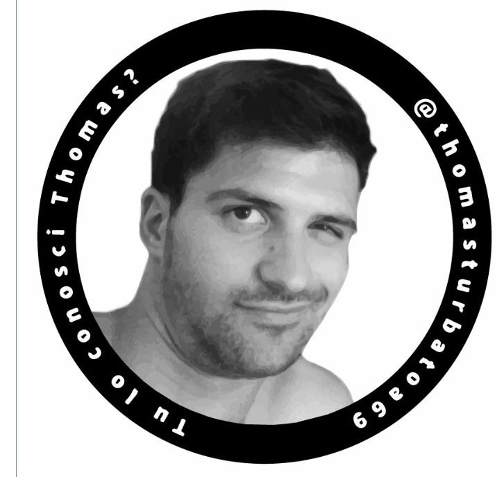
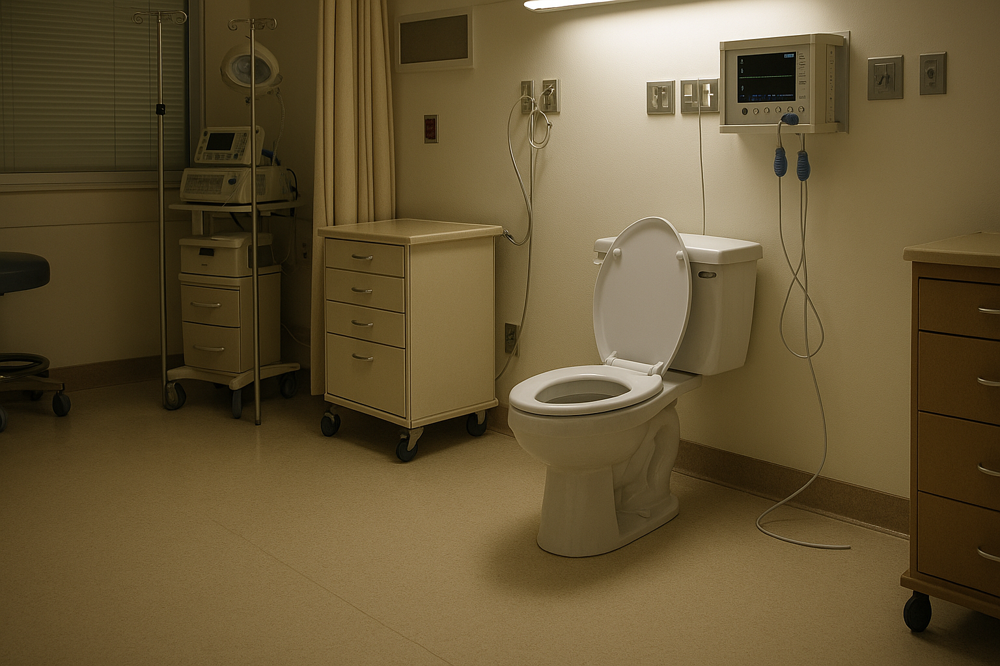
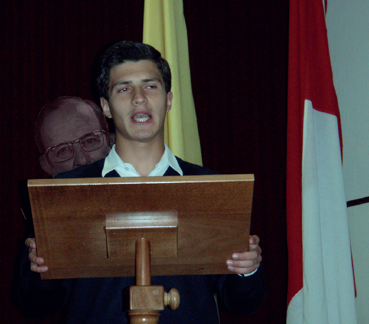
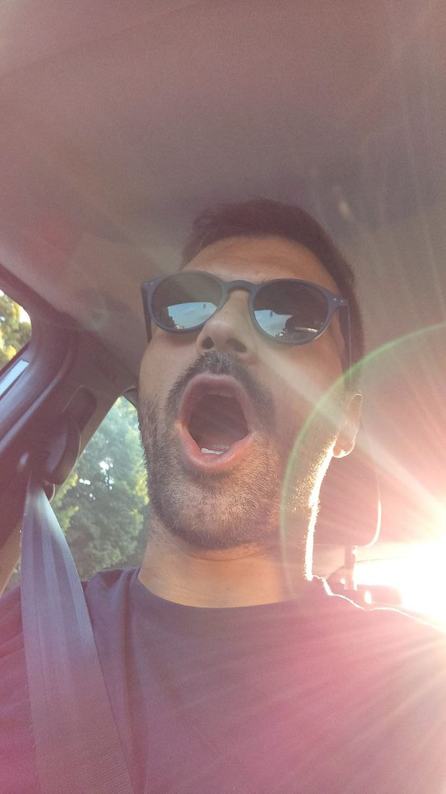
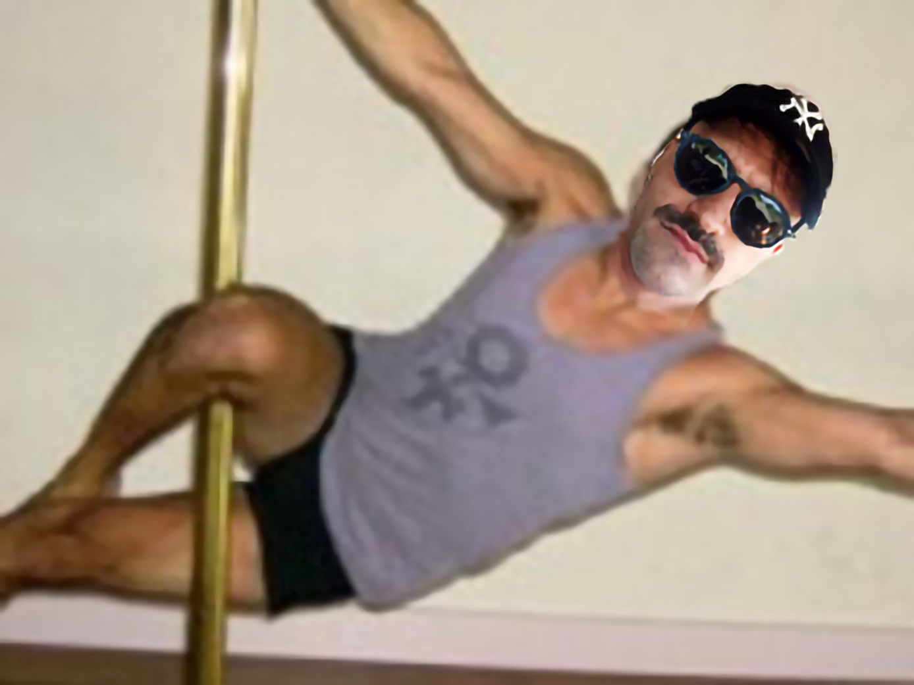
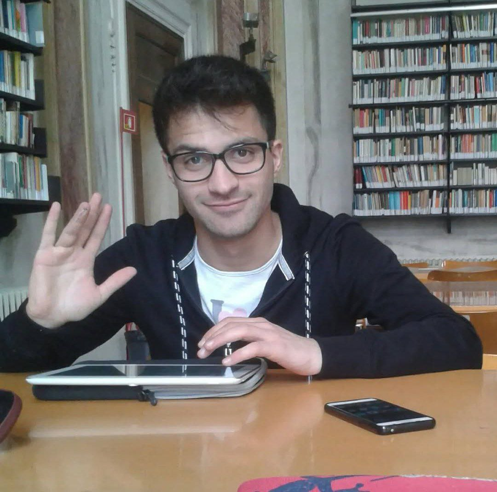
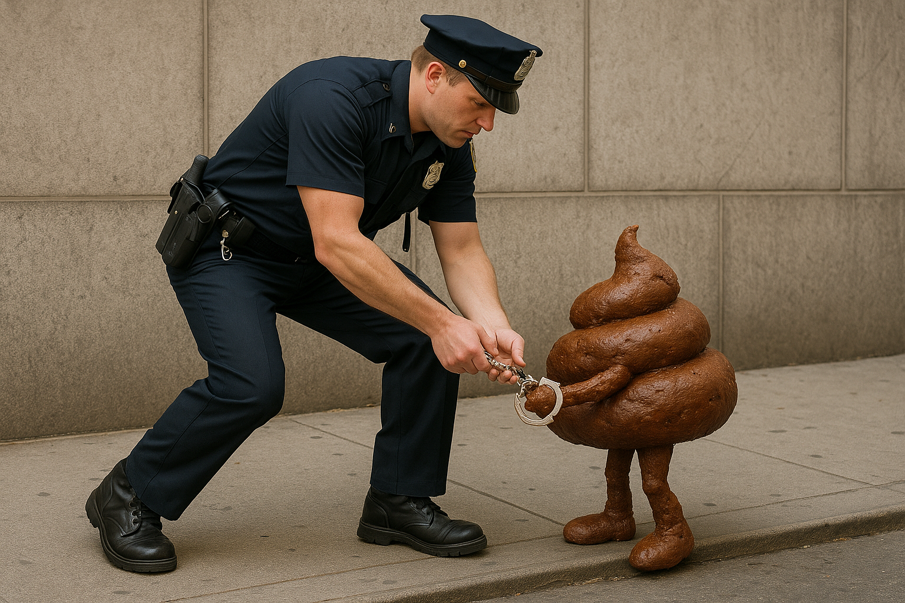

<html lang="it">
<head>
  <meta charset="UTF-8">
  <title>Antonio Maria Anselmi</title>
  
</head>
<body>

  <h1><strong>Antonio Maria Anselmi</strong></h1>
  

  
  
<em>Sigillo d'approvazione</em>
 

  
<strong>Antonio Anselmi</strong> (detto Tony, Capea, Thomas Turbato; nato a Padova il 22 luglio 1992 - scomparso a Madrid il 24 maggio 2025) è un celebre caso mediatico in seguito alla sua scomparsa avvenuta a Madrid il 24 maggio 2025.

  
Individuo di origine incerta tra il clero e il sottobosco calcistico padovano, noto per una carriera eclettica che spazia dal seminario al torneo del palo, passando per studi universitari prolungati e una quantità non trascurabile di episodi gastrointestinali documentati.

  

  

    <h2>Biografia</h2>

  <h3>Infanzia e contesto familiare</h3>

  
<em>Foto d'epoca della sala ove avvenne il lieto evento della nascita di Antonio; oggi trasformato in luogo di penegrinaggio</em>

  
Antonio nasce il 22 luglio 1992 <small><i>(così almeno dicono)</i></small> da genitori già rodati, Betta e Vinicio, come quinto di una prolifica nidiata. La nascita avviene in un clima estivo afoso, fatto di zanzare e scarsa ispirazione da parte dei genitori (che qui hanno fatto un pessimo lavoro). Fin dalla tenera età si distingue per la propensione alla fuga, alla ribellione e a capigliature discutibili. In giovanissima età manifesta un’attitudine alla monelleria e a forme precoci di egocentrismo patologico.

   <h3>Formazione religiosa e Seminario di Gozzano</h3>
    
A circa dieci anni, viene avviato alla carriera ecclesiastica e iscritto al Seminario di Gozzano. Qui si distingue per la precoce vocazione e l’ambizione smisurata, guadagnandosi il soprannome di "Monsignore" <small><i>(Maciel, M. (2006). Mi vida es Cristo. Editorial ART)</i></small>. Parallelamente sviluppa notevoli competenze nel leccaculismo istituzionale, descritte da fonti coeve come “straordinariamente pratico nella rimozione di residui fecali per sacrum osculum”.

 

<em>Il Monsignore durante uno dei suoi accorati appelli alla castità prematrimoniale (dai che manca poco!)</em>

Durante il periodo seminaristico nasce la sua travagliata relazione con Guillermo Meade, figura di rilievo nella sua formazione spirituale e fisica. Il cammino intrapreso nell'anima secondo i dettami della <i>spiritualità a due vie</i>, segnerà profondamente il carattere del ragazzo, aprendolo a nuove esperienze trascendentali. Il rapporto, definito da più analisti come <i>"intenso e plurisensoriale"</i>, implica pratiche quotidiane di subordinazione volontaria, tra cui il nutrimento del master con albumi e Weetabix e la ricezione dallo stesso - secondo alcune testimonianze – di secrezioni a base proteica non meglio identificate.

  <h3>Adolescenza e istruzione informale</h3>
    
Antonio completa gli studi liceali presso il medesimo istituto, distinguendosi per una marcata inclinazione al turpiloquio e alla flatulenza. Tra i momenti significativi si segnala l’approccio traumatico allo studio del mandolino, culminato in un incidente cranico, e la passione per la matematica applicata al corpo umano, nello specifico alle sue funzioni evacuative <small><i>(Anselmi A., Approssimazioni Newtoniane del Tempo di Evacuazione, 2010, Edizioni della Strada)</i></small>.

Di rilievo la dieta a base di risotto all’aceto, responsabile di una forma di diarrea cronica che influenzò il suo metabolismo e ne limitò lo sviluppo fisico. 

  
  
<em>Antonio durante una delle sue Epifanie Estatiche ottenute solitamente in seguito a lunghe sessioni di sfregamento del Palo Santo</em>

Di particolare significanza storica è l'episodio che sancisce il suo passaggio dalla militanza conservatrice a posizioni di centrosinistra ecclesiale. Durante un pomeriggio di routine nella biblioteca del seminario, Antonio inscena una fuga teatrale da una finestra. Questo episodio, noto come “la defenestrazione del Pristina”, segna la rottura simbolica con l’obbedienza cieca e l’inizio di una fase di turbolenza ideologica.

  

    <h2>Soggiorno all’estero</h2>

   <h3>Periodo spagnolo</h3>
    
Trascorre un periodo a Salamanca, su cui esistono scarse fonti. Tuttavia, è certo che tale esperienza abbia avviato lo sviluppo di insonnia e numerosi traumi psicologici, dagli esisti ancora incerti e tuttora oggetto di studio.

Le uniche testimonianze scritte sono:
- una nota nelle cronache ufficiali, che riporta semplicemente: “Gran Bevitore.” Tenendo conto il poco alcol permesso dalle norme, gli storici dibattono ancora su quale fosse il liquido in questione <small><i>(la storiografia è divisa tra chi sostiene si trattasse di fermenti lattici e chi di succo di cetriolo)</i></small>.

- un documento medico redatto in seguito a test psicologico. Tale documento riporta una diagnosi di *Disturbo Post-Traumatico da Convitto (DPTC) <small><i>(lo ha letto Andreone da qualche parte)</i></small>. Tra i sintomi segnalati figurano: bisogno cronico di attenzione, comportamento istrionico, incidenti autolesionisti, ed eccessivo coinvolgimento emotivo in contesti calcistici di terza categoria <small><i>(soprattutto il PALO, n.d.r.)</i></small>.

  

    <h2>Ritorno a Padova</h2>

    <h3>Carriera sportiva</h3>
    
Anselmi ha militato in diverse squadre di calcetto e calcio a 7, con alterne fortune. È noto soprattutto per il suo impegno nei *Lemme Lemme*, formazione familiare creata per il celebre Torneo del Palo. Sebbene odiati da gran parte del pubblico e degli avversari, i Lemme Lemme si sono distinti per longevità, affiatamento e inaspettate vittorie.

  
  
<em>Finalista del torneo di palo 2015, forse l'hanno più "duro" della sua carriera</em>

La sua carriera sportiva è segnata da numerosi infortuni, che tuttavia non lo hanno distolto dalla frequentazione assidua degli spogliatoi maschili e da una curiosa tendenza a commentare le dotazioni anatomiche altrui.

   
  

    <h2>Studi Universitari</h2>
    
Dopo il ritorno a Padova, Anselmi si iscrive a Scienze Politiche. Inizialmente si professa single convinto, ma finisce rapidamente per legarsi sentimentalmente e intraprendere un lungo periodo di “reclusione affettiva”. In questo periodo mantiene le attività calcistiche e accademiche, anche se con tempi di completamento dell’università più vicini alla Quaresima che alla sessione estiva.

 

  
  
<em>Il Ghepardo al suo picco seduttivo</em>

È noto per essere stato un frequentatore assiduo di aule studio, usandole più che come luoghi di istruzione, come terreni di caccia, aggirandosi tra i banchi come un ghepardo ormonale alla ricerca di un’abbondanza ortopedica su cui avventarsi; sfoggiando il massimo delle proprie capacità seduttive, dando così inizio a una nuova fase biografica.

    
  

  

    <h2>Il caso mediatico</h2>

  <h2>Arresto e scomparsa</h2>

   

  
  
<em>Ultima foto esistente di Antonio durante l'arresto, da questo momento in poi le sue tracce si perdono nei marasmi della burocrazia giudiziaria</em>

Durante una gita con amici a Madrid, il 24 maggio 2025, per ragioni ancora da chiarire, Antonio è stato arrestato e condotto in carcere <small><i>(secondo El País, l'arresto sarebbe avvenuto durante una rissa a base di karaoke e sangria)</i></small>. Nonostante le testimonianze dei compagni, la polizia spagnola nega tale avvenimento, risultando a tutt'oggi ufficialmente scomparso. Le fiacche e poco insistenti lamentele dei compagni non sono state sufficienti a fare chiarezza sul caso <small><i>(secondo certi l'inefficacia delle rimostranze fu dovuta al fatto che furono trascritte su carta igienica e inviate via corriere low-cost)</i></small>.

   
  

    <h2>Ideologia e affiliazioni</h2>
    
Antonio si dichiara moderato (Partito Carismatico dei Moderati Incerti), ma manifesta tendenze democristiane di fondo, con tratti di ambiguità politica e spirituale. La sua adesione a strutture comunitarie è intensa ma ciclica, e la sua capacità di assumere ruoli di potere è direttamente proporzionale alla possibilità di farsi notare.

  

  

    <h2>Eredità e interpretazioni</h2>
    
Alla sua scomparsa, Antonio lascia una vasta mole di materiali scadenti, un paio di scarpe ancora calde e un profilo Facebook attivo. La sua figura è oggetto di dibattito tra studiosi di psicopatologia, tifosi del Palo e sessuologi gesuiti.

Viene commemorato ogni anno con la "Notte del Pristina", un rito collettivo che prevede il canto ad alta voce delle sue opere più note (La Diagnosi, La mia sparizione in Olanda, Jefferson) e una danza rituale attorno a una padella di risotto all’aceto.

  

  

    <h2>Dibattiti storiografici</h2>
    <ul>
      <li>Il numero esatto di eiaculazioni del Meade ingerite da Anselmi è oggetto di dibattito accademico.</li>
      <li>Secondo alcune fonti, il colpo in testa ricevuto dal mandolino sarebbe stata in realtà un tentativo di autodifesa da parte del mandolino vittima di gesti poco pudichi indesiderati.</li>
      <li>Il risotto all’aceto è stato candidato come patrimonio immateriale della tragicommedia educativa piemontese.</li>
      <li>Lo storico della Legione di Cristo, David Murray nel suo saggio "Un racconto di uso e abuso" insiste nel suggerire che la sua altezza limitata sia stata indotta volontariamente per rendere più agevole lo svolgimento della sua funzione di inalatore di etere posteriore.</li>
    </ul>
  

